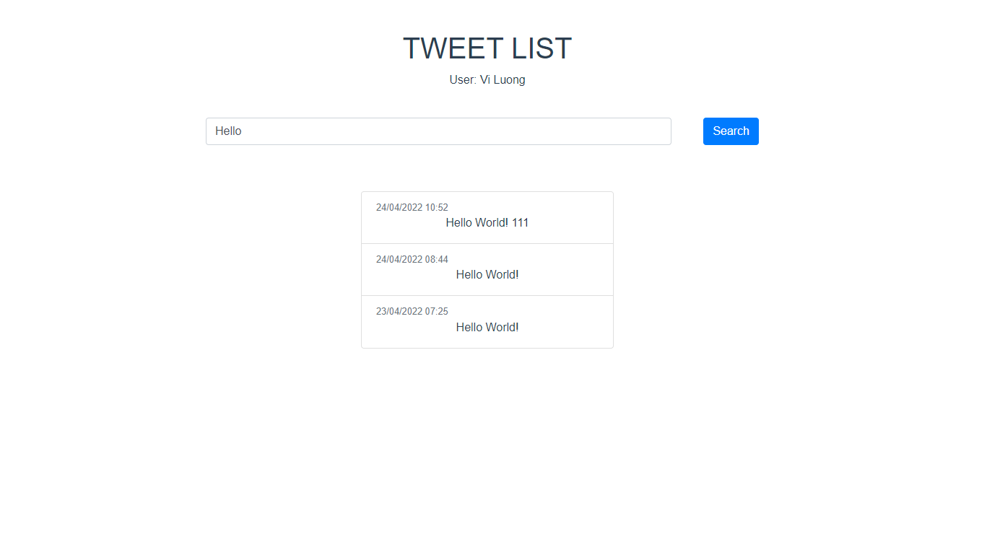

# Tw33t test

My testing: https://github.com/CubiCasa/developer-review
## Requirements

1. Install docker and docker-compose if needed
2. Clone this repo to your local machine
3. Get Twitter Bearer token

## How to run

1. Clone git source
2. Cd to project
3. Rename .env-example to .env and set variable enviroment
   (Note: BEARER_TOKEN is required. - Ref: https://developer.twitter.com/en/docs/authentication/oauth-2-0/bearer-tokens) 
4. Build the docker image and start server:

```
docker-compose build
docker-compose up
```

5. Go to http://localhost:8080/



## Note
Front-end source: ./app/tw33t/templates/tweet_portal/
Log relevant information about each search to a file: ./app/record.log